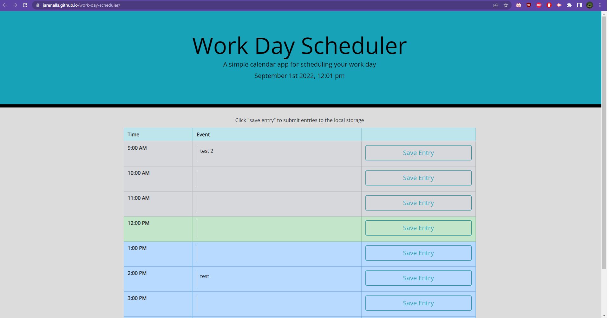

# work-day-scheduler
A tool to help schedule your work day.
The hours from 9-5 are listed and have an input field where events from your schedule can be input and saved
The current date and time is also displayed
The current hour is marked in green, while upcoming hours are marked in blue, and past hours in grey
